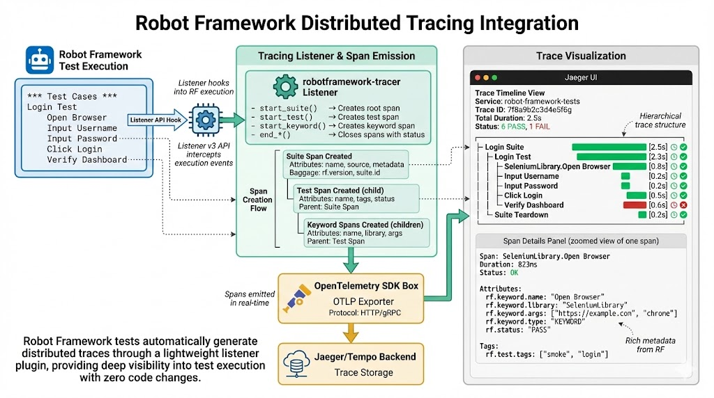

# Robot Framework Tracer

OpenTelemetry distributed tracing integration for Robot Framework test execution.

## What is this?

`robotframework-tracer` is a Robot Framework listener plugin that automatically creates distributed traces, logs, and metrics for your test execution using OpenTelemetry. It captures the complete test hierarchy (suites → tests → keywords) as spans and exports them to any OpenTelemetry-compatible backend like Jaeger, Grafana Tempo, SigNoz, or Zipkin.

This enables you to:
- **Visualize test execution flow** with detailed timing information
- **Debug test failures** by examining the complete execution trace with correlated logs
- **Analyze performance** and identify slow keywords or tests
- **Monitor test health** with metrics dashboards and alerting
- **Correlate tests with application traces** in distributed systems
- **Track test trends** across CI/CD pipelines
- **Propagate trace context** to your System Under Test (SUT)



## How it works

The tracer implements the Robot Framework Listener v3 API and creates OpenTelemetry spans for each test execution phase:

```
Suite Span (root)
├── Suite Setup (SETUP span)
├── Test Case Span
│   ├── Keyword Span
│   │   └── Nested Keyword Span
│   └── Keyword Span
├── Test Case Span
│   └── Keyword Span
└── Suite Teardown (TEARDOWN span)
```

Each span includes rich metadata: test names, tags, status (PASS/FAIL), timing, arguments, and error details.

**Additionally:**
- **Logs** are sent via OpenTelemetry Logs API with trace correlation
- **Metrics** are automatically emitted for test execution analysis

## Installation

### From PyPI (when released)

```bash
pip install robotframework-tracer
```

### From Source (Development)

```bash
# Clone the repository
git clone <repository-url>
cd robotframework-tracer

# Create and activate virtual environment
python3 -m venv venv
source venv/bin/activate  # On Windows: venv\Scripts\activate

# Install in development mode
pip install -e ".[dev]"
```

See [docs/DEVELOPMENT.md](docs/DEVELOPMENT.md) for detailed development setup instructions.

## Quick Start

### 1. Start a tracing backend (Jaeger example)

```bash
docker run -d --name jaeger \
  -p 16686:16686 \
  -p 4318:4318 \
  jaegertracing/all-in-one:latest
```

### 2. Run your tests with the listener

```bash
# Basic usage (uses default endpoint localhost:4318)
robot --listener robotframework_tracer.TracingListener tests/

# With environment variables (recommended for custom endpoints)
export OTEL_EXPORTER_OTLP_ENDPOINT=http://jaeger:4318/v1/traces
export OTEL_SERVICE_NAME=my-tests
robot --listener robotframework_tracer.TracingListener tests/

# With inline options (colon-separated key=value pairs)
robot --listener "robotframework_tracer.TracingListener:service_name=my-tests:capture_logs=true" tests/

# With custom endpoint (URL colons are automatically handled)
robot --listener "robotframework_tracer.TracingListener:endpoint=http://jaeger:4318/v1/traces:service_name=my-tests" tests/
```

> **Note:** Robot Framework splits listener arguments on `:`. Use colons to separate options. URLs containing `://` are automatically reconstructed.

### 3. View traces

Open http://localhost:16686 in your browser to see your test traces in Jaeger UI.

## Trace Context Propagation

The tracer supports two forms of trace context propagation:

### Inheriting Parent Context (Inbound)

When the `TRACEPARENT` environment variable is set (following the [W3C Trace Context](https://www.w3.org/TR/trace-context/) standard), the suite span automatically becomes a child of the external parent trace. This enables:

- **CI/CD correlation**: A pipeline step creates a parent span and exports `TRACEPARENT` before running tests
- **Parallel execution**: Tools like [pabot](https://pabot.org/) can use a wrapper script to create a parent span and propagate context to worker processes
- **Nested orchestration**: Any process that sets `TRACEPARENT` in the environment before invoking Robot Framework

```bash
# Example: set by a CI pipeline or wrapper script
export TRACEPARENT="00-4bf92f3577b34da6a3ce929d0e0e4736-00f067aa0ba902b7-01"
export TRACESTATE="vendor1=value1"  # optional
robot --listener robotframework_tracer.TracingListener tests/
```

The suite span will appear as a child of trace `4bf92f3577b34da6a3ce929d0e0e4736` in your tracing backend.

### Propagating Context to SUT (Outbound)

The tracer automatically makes trace context available as Robot Framework variables for propagating to your System Under Test:

```robot
*** Test Cases ***
Test API With Distributed Tracing
    # HTTP headers automatically include trace context
    ${response}=    POST    http://my-sut/api
    ...    json={"data": "test"}
    ...    headers=${TRACE_HEADERS}
    
    # For custom protocols, use individual components
    ${diameter_msg}=    Create Diameter Request
    ...    trace_id=${TRACE_ID}
    ...    span_id=${SPAN_ID}
```

**Available variables:**
- `${TRACE_HEADERS}` - HTTP headers dictionary
- `${TRACE_ID}` - 32-character hex trace ID  
- `${SPAN_ID}` - 16-character hex span ID
- `${TRACEPARENT}` - W3C traceparent header
- `${TRACESTATE}` - W3C tracestate header

See [docs/trace-propagation.md](docs/trace-propagation.md) for complete examples.

## Configuration

### Basic usage

```bash
robot --listener robotframework_tracer.TracingListener tests/
```

### Custom endpoint

```bash
robot --listener robotframework_tracer.TracingListener:endpoint=http://jaeger:4318/v1/traces tests/
```

### Custom service name

```bash
robot --listener "robotframework_tracer.TracingListener:endpoint=http://jaeger:4318/v1/traces,service_name=my-tests" tests/
```

### All configuration options

```bash
robot --listener "robotframework_tracer.TracingListener:\
endpoint=http://localhost:4318/v1/traces,\
service_name=robot-tests,\
protocol=http,\
capture_arguments=true,\
max_arg_length=200" tests/
```

### Environment variables

```bash
export OTEL_EXPORTER_OTLP_ENDPOINT=http://localhost:4318
export OTEL_SERVICE_NAME=robot-framework-tests
robot --listener robotframework_tracer.TracingListener tests/
```

## Configuration Options

| Option | Default | Description |
|--------|---------|-------------|
| `endpoint` | `http://localhost:4318/v1/traces` | OTLP endpoint URL |
| `service_name` | `rf` | Service name in traces |
| `protocol` | `http` | Protocol: `http` or `grpc` |
| `span_prefix_style` | `none` | Span prefix style: `none`, `text`, `emoji` |
| `capture_arguments` | `true` | Capture keyword arguments |
| `max_arg_length` | `200` | Max length for arguments |
| `capture_logs` | `false` | Capture log messages via Logs API |
| `log_level` | `INFO` | Minimum log level (DEBUG, INFO, WARN, ERROR) |
| `max_log_length` | `500` | Max length for log messages |
| `sample_rate` | `1.0` | Sampling rate (0.0-1.0, 1.0 = no sampling) |
| `trace_output_file` | `` | Write spans as OTLP JSON to local file (`auto` for suite-name + trace-ID naming) |
| `trace_output_format` | `json` | Output format: `json` or `gz` (gzip-compressed) |

> **Trace file import:** The output file can be imported into any OTLP-compatible backend (Jaeger, Tempo, etc.) by POSTing each line to the OTLP HTTP endpoint. See [docs/configuration.md](docs/configuration.md#importing-trace-files-into-a-backend) for details.

## Span Attributes

Each span includes relevant Robot Framework metadata:

**Suite spans:**
- `rf.suite.name` - Suite name
- `rf.suite.source` - Suite file path
- `rf.suite.id` - Suite ID
- `rf.version` - Robot Framework version

**Test spans:**
- `rf.test.name` - Test case name
- `rf.test.id` - Test ID
- `rf.test.tags` - Test tags
- `rf.status` - PASS/FAIL/SKIP
- `rf.elapsed_time` - Execution time

**Keyword spans:**
- `rf.keyword.name` - Keyword name
- `rf.keyword.type` - SETUP/TEARDOWN/KEYWORD
- `rf.keyword.library` - Library name
- `rf.keyword.args` - Arguments (if enabled)
- `rf.status` - PASS/FAIL

## Log Capture

When `capture_logs=true`, Robot Framework log messages are sent to the OpenTelemetry Logs API and automatically correlated with traces:

**Log Attributes:**
- `body` - Log message text
- `severity_text` - Log level (INFO, WARN, ERROR, FAIL)
- `severity_number` - Numeric severity (9=INFO, 13=WARN, 17=ERROR, 21=FAIL)
- `trace_id` - Correlated trace ID
- `span_id` - Correlated span ID (keyword/test that generated the log)
- `rf.log.level` - Original Robot Framework log level

**Endpoints:**
- Traces: `/v1/traces` (OTLP)
- Logs: `/v1/logs` (OTLP)
- Metrics: `/v1/metrics` (OTLP)

Logs appear in your observability backend's Logs UI with full trace correlation, enabling you to:
- Jump from log → trace
- Jump from trace → related logs
- Filter logs by trace ID
- View logs in context of test execution

## Metrics

The tracer automatically emits OpenTelemetry metrics for test execution analysis:

**Test Metrics:**
- `rf.tests.total` - Total tests executed (with suite dimension)
- `rf.tests.passed` - Tests that passed
- `rf.tests.failed` - Tests that failed (with suite and tag dimensions)
- `rf.tests.skipped` - Tests that were skipped
- `rf.test.duration` - Test execution time histogram (with suite and status dimensions)

**Suite Metrics:**
- `rf.suite.duration` - Suite execution time histogram (with suite and status dimensions)

**Keyword Metrics:**
- `rf.keywords.executed` - Total keywords executed (with type dimension)
- `rf.keyword.duration` - Keyword execution time histogram (with keyword, type, and status dimensions)

Metrics enable:
- **Dashboards** - Visualize test health and trends over time
- **Alerting** - Alert when pass rate drops or execution time increases
- **Performance Analysis** - Track test execution time trends
- **Failure Analysis** - Group failures by suite or tag

Metrics are sent to `/v1/metrics` endpoint and share the same service name and resource attributes as traces for correlation.

## Supported Backends

Works with any OpenTelemetry-compatible backend:
- **Jaeger** - Open source tracing platform
- **Grafana Tempo** - High-scale distributed tracing
- **Zipkin** - Distributed tracing system
- **AWS X-Ray** - AWS distributed tracing
- **Honeycomb** - Observability platform
- **Datadog** - Monitoring and analytics

See [docs/backends.md](docs/backends.md) for backend-specific setup guides.

## Requirements

- Python 3.8+
- Robot Framework 6.0+
- OpenTelemetry SDK

## Documentation

- [Architecture](docs/ARCHITECTURE.md) - Design and architecture details
- [Implementation Plan](docs/IMPLEMENTATION_PLAN.md) - Development roadmap
- [Configuration Guide](docs/configuration.md) - Detailed configuration reference
- [Attribute Reference](docs/attributes.md) - Complete attribute documentation
- [Backend Setup](docs/backends.md) - Backend-specific guides

## Examples

See the [examples/](examples/) directory for complete examples:
- Basic usage with Jaeger
- Advanced configuration
- CI/CD integration
- Multiple backend setups

## Contributing

Contributions are welcome! Please see [docs/CONTRIBUTING.md](docs/CONTRIBUTING.md) for guidelines.

## License

Apache License 2.0 - See [docs/LICENSE](docs/LICENSE) for details.

## Status

**Current Version:** v0.4.0  
**Status:** Production-ready with full observability (traces, logs, metrics)

**Features:**
- ✅ Distributed tracing with parent-child span relationships
- ✅ Log capture via OpenTelemetry Logs API with trace correlation
- ✅ Metrics emission for test execution analysis and monitoring
- ✅ Trace context propagation (inbound via TRACEPARENT, outbound to SUT)
- ✅ Support for parallel execution (pabot)

See [docs/CHANGELOG.md](docs/CHANGELOG.md) for version history and [docs/IMPLEMENTATION_PLAN.md](docs/IMPLEMENTATION_PLAN.md) for the development roadmap.
